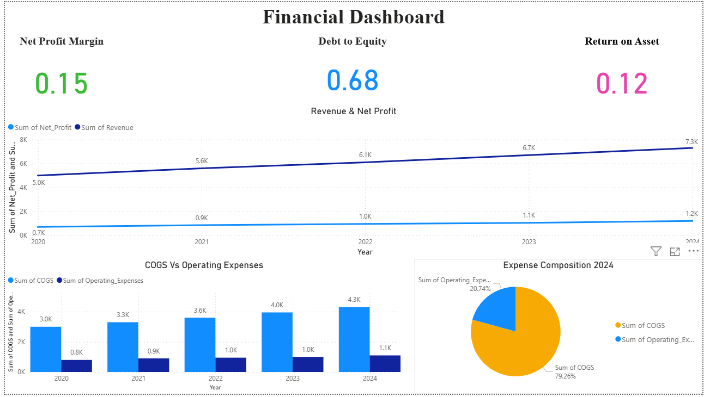

# Financial Dashboard | Power BI

## Project Overview
This project presents an interactive Financial Dashboard built using Power BI to analyze key financial performance indicators. The dashboard helps visualize profitability, revenue trends, and expense composition to support better financial decision-making.

## Key Metrics Analyzed
- Net Profit Margin
- Debt to Equity Ratio
- Return on Assets (ROA)
- Revenue vs Net Profit Trend
- COGS vs Operating Expenses
- Expense Composition

## Dashboard Insights
- Revenue and net profit trends from 2020 to 2024
- Comparison between Cost of Goods Sold (COGS) and Operating Expenses
- Expense distribution for financial analysis
- Financial performance indicators for evaluating company profitability

## Tools Used
- Power BI
- DAX
- Excel (Data Source)

## Dashboard Preview

## Key Learnings
- Creating KPI indicators for financial metrics
- Financial ratio analysis using Power BI
- Building interactive dashboards for business insights
- Data visualization for financial performance tracking
